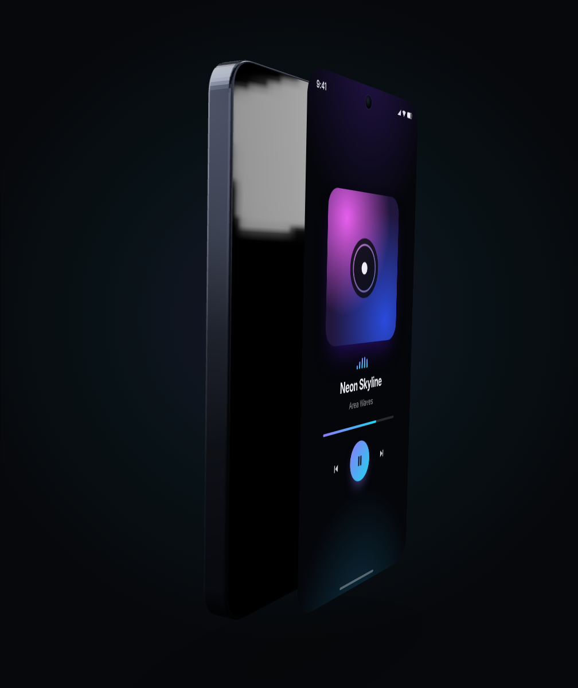
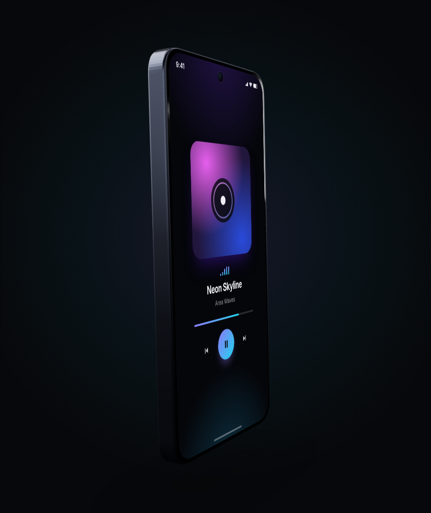
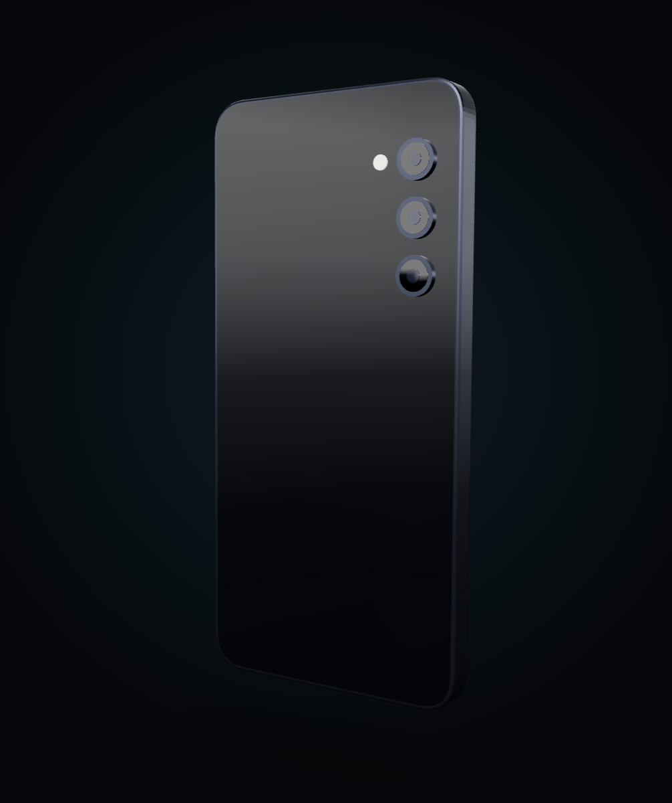
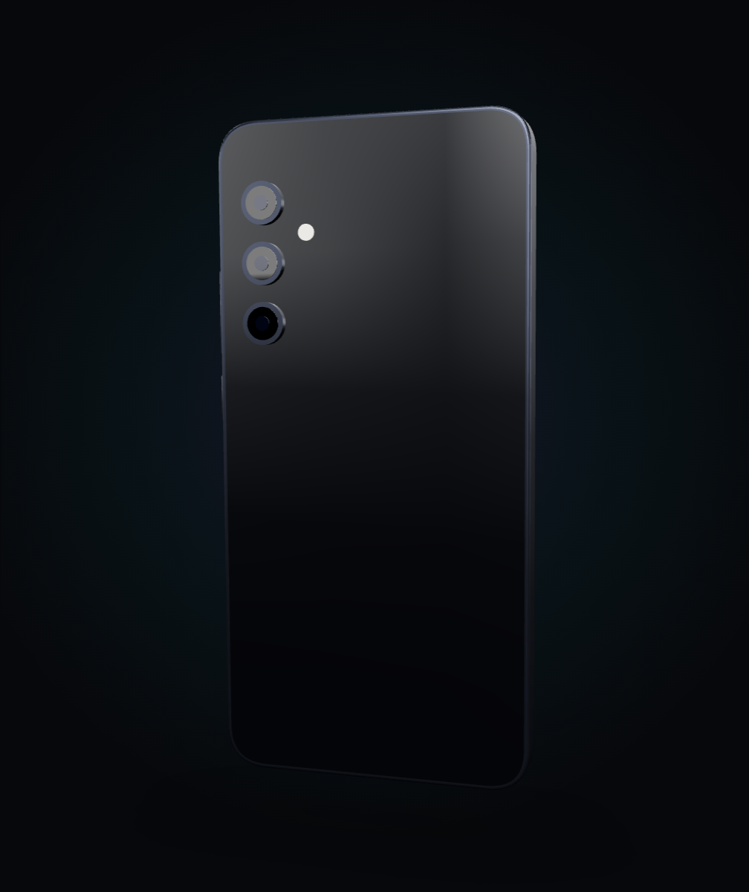
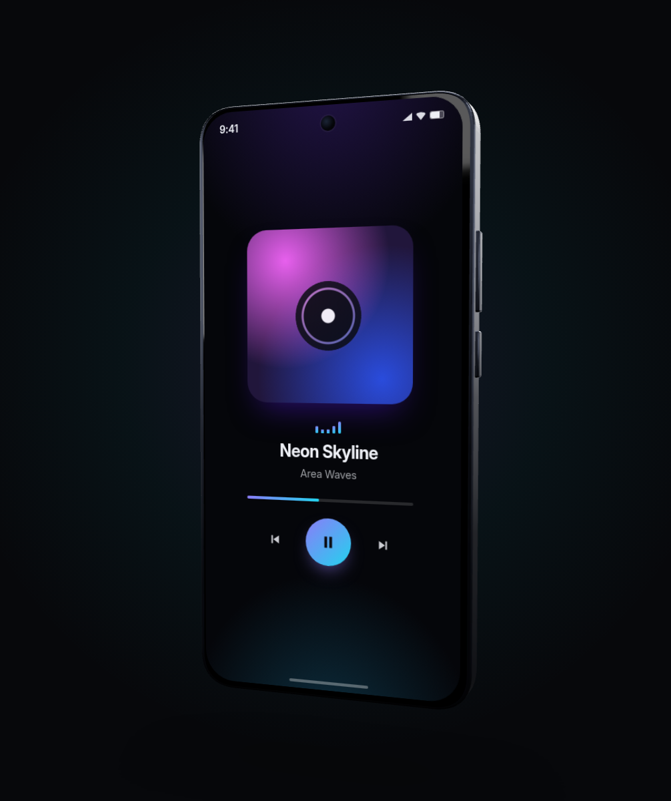
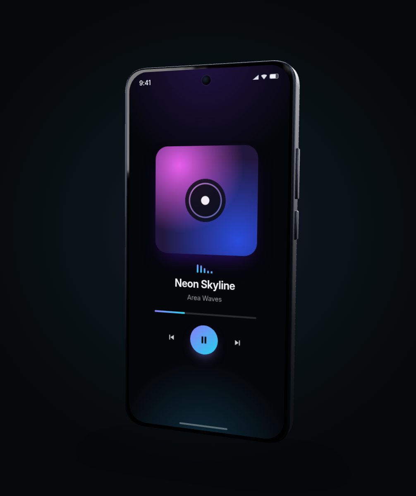

# Galaxy S25 mockup — interaction & alignment fixes

**Date:** 2026-07-09
**Branch:** `claude/galaxy-s25-mobile-ui-yv12c9`
**Scope:** `packages/area-mockups` (library) + `apps/docs` (docs site)

Three issues were reported against the 3D phone mockup:

| # | Report | Verdict |
|---|--------|---------|
| A1 | "Drag to spin doesn't work well… sometimes works when I use a high velocity." Follow-up: "dragging on the user-supplied graphic does not spin." | Reproduced & fixed |
| A2 | "Any region of the play button should be clickable. The play/pause icon region is not clickable." | Not reproducible in Chromium; defensively fixed |
| A3 | "Ensure that the graphic is in the correct position — the screen looks like it is 'floating'." Follow-up: "the overlaying graphic doesn't sit right on the screen" (+ screenshot). | Reproduced & fixed (two distinct causes) |

All fixes were verified end-to-end with scripted Playwright runs against the docs
site (headless Chromium 141, multiple viewports/DPRs).

---

## A1 — Drags starting on the screen never rotated the device

### Root cause

The phone's screen is real DOM, portaled by drei's `<Html transform>` **on top of**
the WebGL canvas. `OrbitControls` listens on the canvas's ancestor, and the screen
wrapper called `event.stopPropagation()` on every `pointerdown` so screen content
stayed clickable. Net effect: any gesture that **started** on the glass never
reached the controls — and the glass is most of the phone's face. Drags only
worked when they started on the thin bezel or the background, which is why fast,
imprecise flicks "sometimes" worked: they occasionally landed outside the glass.

### Fix (`packages/area-mockups/src/devices/phone/phone.tsx`)

Tap-vs-drag discrimination with a mid-gesture handoff, on by default as a new
`dragToRotate` prop (`Phone` + `PhoneMockup`):

1. `pointerdown` on the screen still stops propagation (taps stay content-only).
2. Window-level listeners watch the pointer. Within 10 px of travel, nothing
   changes — release ⇒ a normal click for your content.
3. Past 10 px, the press is **replayed on the canvas** as a synthetic
   `pointerdown` at the pointer's current position. The orbit controls pick it
   up and take pointer capture, so the rest of the gesture spins the device, and
   the content never receives a click for that gesture.
4. The wrapper sets `touch-action: none` while `dragToRotate` is on so touch
   gestures aren't claimed by browser scrolling. Content that needs its own drag
   gestures (sliders, drawing, touch scrolling) can opt out with
   `dragToRotate={false}`, which restores the previous behavior exactly.

`interactive={false}` screens are untouched: their events already pass through to
the controls natively.

### Verified

- Drag starting on screen content rotates the device (previously: no rotation).
- Plain click on an on-screen button still works (tap counter increments).
- A sloppy 4 px "tap" still counts as a click.
- A real 100 px drag across a button rotates and does **not** click it.

---

## A2 — Play/pause icon region reported as not clickable

### Investigation

Could not be reproduced in headless Chromium: `document.elementsFromPoint` at the
icon's center resolves `svg → button.mp-play`, and scripted clicks dead-center on
the icon toggled play/pause at the default angle, at steep angles, and in every
viewport tested. Two adjacent facts make the report entirely plausible elsewhere:

- Hit-testing of **SVGs nested inside 3D-transformed layers** is a known soft
  spot across engines (Playwright's own strict hit-target checker also timed out
  on these controls while raw coordinate clicks passed).
- Until the A3 fix below, some window sizes painted the whole screen layer offset
  from where the browser hit-tests it — clicks aimed at the *visible* icon could
  genuinely land elsewhere. The A3 fix removes that failure mode too.

### Fix (`apps/docs/app/globals.css`)

The standard icon-button hardening, so the button is one uniform hit target and
its glyph can never interfere:

```css
.mp-controls button svg {
  pointer-events: none;
}
```

Any point inside the 64 px circle — icon, ring, or edge — now hits the `<button>`
itself.

---

## A3 — "The screen looks like it is floating" (two separate causes)

### Cause 1: CSS3D screen painted detached from the glass at certain window sizes

**Reproduced in Chromium** at a 1337×851 window (any DPR): after orbiting to a
steep angle, the DOM screen rendered narrower, under-rotated and visibly floating
in front of the phone — matching the reported screenshot exactly.

Instrumentation showed drei's `<Html transform>` was writing **correct, per-frame
updated** CSS (`perspective`, camera matrix3d, object matrix3d) in both good and
bad configurations — identical values, different paint. The trigger is the page
layout: at odd window widths the centered `max-width` layout lands the canvas at
a **fractional page offset** (e.g. `margin-left: 108.5px`), and Chromium then
rasterizes the `perspective → preserve-3d → matrix3d` chain against a snapped
origin, mis-projecting the entire subtree.

**Fix:** promote the Html portal root (the element carrying the CSS
`perspective`) to its own compositor layer. The library now passes
`wrapperClass="area-mockups-screen-layer"` and ships a one-rule `<style>` with
the screen:

```css
.area-mockups-screen-layer { will-change: transform }
```

Empirically confirmed: with the layer promoted, the broken viewport renders
pixel-perfect at every angle; all previously-good configurations are unchanged.
(`will-change` on any *other* element in the chain does not fix it — it must be
the perspective root.)

### Cause 2: the phone levitated above its shadow

The contact-shadow plane sat at y = −2.5 while the phone's body (height 4,
centered on the origin) ends at y = −2.0 — a permanent half-unit air gap that
read as "floating" even for static mockups.

**Fix:** `MockupCanvas` gains a `shadowY` prop (default −2.05, just under the
bundled phone). `PhoneMockup` grounds static devices at −2.05 and keeps a
deliberate hover gap (−2.3) when `float` is on, clear of the bobbing range.

### Related hardening: float animation now runs before the screen sync

`PhoneMockup` no longer uses drei's `<Float>`, whose frame callback ran *after*
drei `<Html>`'s screen sync (children subscribe before parents), leaving the DOM
screen one frame behind the WebGL body while floating. The visually-identical
internal `FloatGroup` runs at frame priority −2 — before the orbit controls (−1)
and the Html sync (0) — so the screen is always positioned from the current
frame's device pose. (Sub-pixel per frame in practice, but now exact by
construction, and it drops a dependency.)

---

## Galaxy S25 fidelity pass

Referenced the real device (Samsung design pages, GSMArena, Wikipedia):
146.9 × 70.5 × 7.2 mm, 6.2″ flat 19.5:9 display (2340×1080), centered punch-hole,
flat frame, and three individually **floating lens rings** stacked vertically in
the top corner of the back with the LED flash beside the stack.

Corrections made (`dimensions.ts`, `phone.tsx`):

- **Camera module was mirrored.** Viewed from the back, the lens column sat
  top-right with the flash on its far side. It now sits **top-left with the
  flash to its right**, matching the S25.
- Flash repositioned to the gap between the top and middle lens (was level with
  the top lens).
- Body depth 0.2 → **0.196** world units — 7.2 mm at the model's ~36.7 mm/unit
  scale (the S25 is 0.4 mm thinner than the S24 the old number approximated).
- Existing proportions validated against the real device and kept: body
  1.92 × 4.0 (≈ 70.5 × 146.9 mm), display 1.8 × 3.9 (19.5:9), punch-hole radius
  0.05 at 0.12 from the top edge, volume rocker + power on the right side.

The docs' remaining `GALAXY` references were also corrected to the actual `PHONE`
export.

---

## Evidence

| Before | After |
|--------|-------|
|  |  |
|  |  |
|  |  |

Additional: [static demo card, grounded and rotated via a screen-drag](images/after-static-grounded.png).

Final verification run (headless Chromium):

```
PASS  A3: portal root has will-change:transform (transform)
PASS  A2: icon-center click toggles play/pause (Pause -> Play)
PASS  A2: ring click toggles play/pause (Play -> Pause)
PASS  A1: drag starting on screen rotates device
PASS  A1: tap on screen button still clicks (0 -> 1)
PASS  A1: sloppy tap (<10px) still clicks (1 -> 2)
PASS  A1: drag over button rotates instead of clicking (2 -> 2)
ALL CHECKS PASSED
```

`npm run typecheck` and `npm run build:pkg` pass. Public API additions are
backwards-compatible: `Phone.dragToRotate?: boolean = true`,
`MockupCanvas.shadowY?: number = -2.05` (both inherited by `PhoneMockup`).

---

## Appendix: open-source 3D model sources usable with this package

Asked alongside the bug reports: where to find open 3D models (phones, and
generally — emoji, animals, props) for react-three-fiber scenes. Verified July
2026; glTF/GLB loads directly via drei's `useGLTF`, and
[`gltfjsx`](https://github.com/pmndrs/gltfjsx) converts models to typed JSX
components.

**Phones.** No manufacturer publishes open 3D models. Community-made models live
on **Sketchfab** (search downloadable + CC license): recent iPhones and Samsung
Galaxy models (incl. an S25) exist, mostly CC-BY, some CC-BY-NC-ND — check each
model's license individually. Legal caveat: a CC license covers the artist's
mesh, **not** Samsung/Apple's trademarks and trade dress; for commercial
marketing, generic unbranded devices (like this package's procedural phone) are
the safer route.

**General libraries (all verified live):**

| Source | License | Notable content | Formats |
|--------|---------|-----------------|---------|
| [Poly Pizza](https://poly.pizza) | Mostly CC-BY, filterable CC0 | ~10.5k low-poly props/animals (Google Poly archive) | glTF, OBJ, FBX |
| [Quaternius](https://quaternius.com) | CC0 | 70+ packs: animals, characters, environments | glTF, FBX, OBJ, Blend |
| [Kenney](https://kenney.nl) | CC0 | Huge game-asset library, props/characters | GLB primary |
| [Smithsonian 3D](https://3d.si.edu) | CC0 | 2,000+ scanned museum objects | glTF, OBJ |
| [Khronos glTF Sample Assets](https://github.com/KhronosGroup/glTF-Sample-Assets) | Mixed per model | Canonical glTF test models | glTF/GLB |
| Sketchfab (downloadable filter) | Per model | Everything, incl. phones | GLB usually |

**3D emoji:** no true open glTF emoji set exists. Microsoft's Fluent Emoji "3D"
(MIT) and Google's Noto 3D style are rendered PNGs/SVGs, not meshes. Closest
substitutes: emoji-adjacent low-poly props from Quaternius/Poly Pizza, or
extruding flat emoji SVGs (e.g. OpenMoji, CC BY-SA) into geometry with three.js
`SVGLoader` + `ExtrudeGeometry`.

**pmndrs market** (`market.pmnd.rs`) — the r3f ecosystem's CC0 asset market —
currently returns 404; its CC0 source assets remain on GitHub
([pmndrs/market-assets](https://github.com/pmndrs/market-assets)).

Note: this package renders its phone **procedurally** (no asset files) — that
stays the recommended default for the mockup itself; external GLB models are for
composing richer scenes around it via `<MockupCanvas>`.
